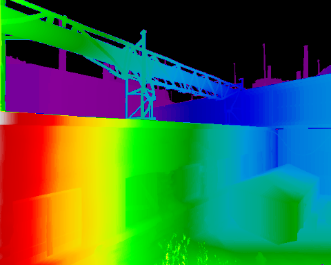
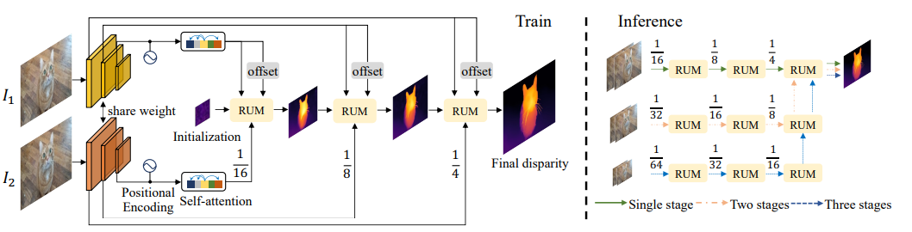

# Stereo Depth Estimation
This module is used to implement - train - inference different neural networks for Stereo depth estimation. The models are implemented in `pytorch` and the training pipeline is implemented on top of `pytorch lightning`. The training can be logged via **wandb** or **tensorboard**.

<p align="center">
  
</p>

## 1. Structure
```
.
├── configs       --> Configuration files
├── criterions    --> Loss functions & metrics
├── data_loaders  --> Data loaders for training
├── __init__.py
├── models        --> Model implementations
├── README.md
├── scripts
├── trainers      --> Trainers
└── train.py      --> Training scripts
```

## 2. How to launch the training
- There are different script in `scripts` corresponding different training on different datasets.
- At the moment, only the training on TartanAir dataset is supported.
- Training arguments:
```
usage: train.py [-h] --model_config MODEL_CONFIG --data_config DATA_CONFIG --training_config TRAINING_CONFIG [--resume_from_checkpoint RESUME_FROM_CHECKPOINT]

options:
  -h, --help            show this help message and exit
  --model_config MODEL_CONFIG
                        Path to model config file
  --data_config DATA_CONFIG
                        Path to data config file
  --training_config TRAINING_CONFIG
                        Path to training config file
  --resume_from_checkpoint RESUME_FROM_CHECKPOINT
                        Path to checkpoint to resume.
```
- Details of models and how to run the training with those models are below.

## 3. How to launch the inference
- Script `nndepth/disparity/scripts/inference.py`:
```
usage: inference.py [-h] --model_config_file MODEL_CONFIG_FILE --weights WEIGHTS --left_path LEFT_PATH --right_path RIGHT_PATH [--HW HW [HW ...]] --output OUTPUT [--render]
                    [--save_format {image,video}]

options:
  -h, --help            show this help message and exit
  --model_config_file MODEL_CONFIG_FILE
                        Path to model config file
  --weights WEIGHTS     Path to model weight
  --left_path LEFT_PATH
                        Path to directory of left images
  --right_path RIGHT_PATH
                        Path to directory of right images
  --HW HW [HW ...]      Model input size
  --output OUTPUT       Path to save output. Directory in case of save_format == image, mp4 file in case of video
  --render              Render results
  --save_format {image,video}
                        Which format to save output. image or video are supported. Default: video
```
- `--weights`: Path to model weights.
- The directory of images you want to infer must have below structure. Each images must have format `{ID}_{side}.png`.
- You can render the results directly use `--render`.
- There are 2 formats to save results:
  - image: Each frame & result will be saved as a png file.
  - video: All frames & results will be saved as a video.
```
.
├── image_left
│   ├── 0_left.png
│   ├── 1_left.png
│   ├── 2_left.png
│   ├── 3_left.png
│   └── 4_left.png
├── image_right
│   ├── 0_right.png
│   ├── 1_right.png
│   ├── 2_right.png
│   ├── 3_right.png
│   └── 4_right.png
```
- Detail commands & weights for each model are in the next section.

## 4. Supported models
- Trained weights and configuration can be found [here](https://drive.google.com/drive/folders/1hoOflbJ_75kmucyyN7eTwFT6le44oDuJ)
<details>
  <summary><b> RAFT-Stereo</b></summary>

  ## Architecture
  - Detail at [RAFT-Stereo](https://arxiv.org/pdf/2109.07547.pdf)
  <p align="center">
  
  </p>

- `ResNet50` & `RepViT` are used as backbone.

  ## Training config
  **BaseRAFTStereo.yaml**
  ```yaml
  # BaseRAFTStereo configuration file
  name: BaseRAFTStereo
  # BaseRAFTStereo
  # RAFTStereo
  # Initialize the RAFTStereo model.
  #
  #         Args:
  #             hidden_dim (int): The hidden dimension. Default is 128.
  #             context_dim (int): The context dimension. Default is 128.
  #             corr_levels (int): The number of correlation levels. Default is 4.
  #             corr_radius (int): The correlation radius. Default is 4.
  #             tracing (bool): Whether to enable tracing for ONNX exportation. Default is False.
  #             include_preprocessing (bool): Whether to include preprocessing steps. Default is False.
  #             **kwargs: Additional keyword arguments.
  #
  iters: 12
  fnet_dim: 256
  hidden_dim: 128
  context_dim: 64
  corr_levels: 4
  corr_radius: 4
  tracing: false
  include_preprocessing: false
  weights: null
  strict_load: true
  ```
  **BaseRAFTStereo_Tartanair.yaml**
  ```yaml
  # TartanairDisparityDataLoader configuration file

  name: TartanairDisparityDataLoader
  # TartanairDisparityDataLoader
  #
  #         DataLoader for training disparity on Tartanair dataset
  #
  #         Args:
  #             dataset_dir (str): path to Tartanair dataset
  #             batch_size (int): batch size
  #             num_workers (int): number of workers
  #             HW (Tuple[int, int]): image size
  #             train_envs (List[str]): list of training environments
  #             val_envs (List[str]): list of validation environments
  #
  dataset_dir: /data/tartanair
  HW: [480, 640]
  train_envs:
  - abandonedfactory
  - amusement
  - carwelding
  - endofworld
  - gascola
  - hospital
  - japanesealley
  - neighborhood
  - ocean
  - office
  - office2
  - oldtown
  - seasidetown
  - seasonsforest
  - seasonsforest_winter
  - soulcity
  - westerndesert
  val_envs:
  - abandonedfactory_night

  # BaseDataLoader
  #
  #         Base class for all data loaders
  #
  batch_size: 6
  num_workers: 8

  ```
  **RAFTTrainer.yaml**
  ```yaml
  # RAFTTrainer configuration file

  name: RAFTTrainer
  # RAFTTrainer
  #
  #         Trainer for RAFT Stereo Model
  #
  #         Args:
  #             lr (float): learning rate
  #             max_steps (int): number of steps to train
  #             num_epochs (int): number of epochs to train
  #             weight_decay (float): weight decay
  #             epsilon (float): epsilon for Adam optimizer
  #             gradient_accumulation_steps (int): number of steps to accumulate gradients
  #             val_interval (Union[float, int]): interval to validate
  #             log_interval (int): interval to log
  #
  lr: 0.0001
  num_epochs: 100
  max_steps: 100000
  weight_decay: 0.0001
  epsilon: 1.0e-08
  gradient_accumulation_steps: 2

  # BaseTrainer
  #
  #         Base class for all trainers
  #
  #         Args:
  #             workdir (str): path to save the experiment
  #             project_name (str): name of the project
  #             experiment_name (str): name of the experiment
  #             val_interval (Union[float, int]): interval to validate
  #             log_interval (int): interval to log
  #             num_val_samples (int): number of samples during evaluation.
  #                Useful to limit the number of samples during evaluation. Defaults to -1 (all samples)
  #             save_best_k_cp (int): number of best checkpoints to save
  #
  workdir: /weights
  project_name: raft_stereo
  experiment_name: BaseRaftStereo
  val_interval: 0.25
  log_interval: 50
  num_val_samples: -1
  save_best_k_cp: 3
  ```

  ## Training command
  ```bash
  python nndepth/nndepth/disparity/train.py --model_config nndepth/disparity/configs/models/BaseRAFTStereo.yaml --data_config nndepth/disparity/configs/data/BaseRAFTStereo_Tartanair.yaml --training_config nndepth/disparity/configs/training/RAFTTrainer.yaml
  ```

  ## Inference command
- Download checkpoint trained on TartanAir [here]() (***will be updated soon***)

```bash
python nndepth/disparity/scripts/inference.py --model_config_file nndepth/disparity/configs/models/BaseRAFTStereo.ymal --weights  PATH_TO_CHECKPOINT --left_path samples/stereo/left/ --right_path samp
les/stereo/right/ --HW 480 640  --output test --save_format image
```

</details>

<details>
  <summary><b> CreStereo</b></summary>

  ## Architecture
  - Detail at [CreStereo](https://arxiv.org/abs/2203.11483)
  <p align="center">
  
  </p>

- `ResNet50` is used as backbone.

  ## Training config
  **CREStereoBase.yaml**
  ```yaml
  # CREStereoBase configuration file

  name: CREStereoBase
  # CREStereoBase
  #
  #         Initialize the CREStereoBase model.
  #
  #         Args:
  #             fnet_cls (str): The class name of the feature extraction network. Default is "basic_encoder".
  #             update_cls (str): The class name of the update block. Default is "basic_update_block".
  #             max_disp (int): The maximum disparity value. Default is 192.
  #             num_fnet_channels (int): The number of channels in the feature extraction network. Default is 256.
  #             hidden_dim (int): The hidden dimension size. Default is 128.
  #             context_dim (int): The context dimension size. Default is 128.
  #             search_num (int): The number of search iterations. Default is 9.
  #             mixed_precision (bool): Whether to use mixed precision training. Default is False.
  #             test_mode (bool): Whether to run the model in test mode. Default is False.
  #             tracing (bool): Whether to enable tracing. Default is False.
  #             include_preprocessing (bool): Whether to include preprocessing steps. Default is False.
  #             **kwargs: Additional keyword arguments.
  #
  fnet_cls: basic_encoder
  update_cls: basic_update_block
  iters: 4
  max_disp: 192
  num_fnet_channels: 256
  hidden_dim: 128
  context_dim: 128
  search_num: 9
  mixed_precision: false
  test_mode: false
  tracing: false
  include_preprocessing: false
  weights: null
  strict_load: true

  ```
  **BaseRAFTStereo_Tartanair.yaml**
  ```yaml
  # TartanairDisparityDataLoader configuration file

  name: TartanairDisparityDataLoader
  # TartanairDisparityDataLoader
  #
  #         DataLoader for training disparity on Tartanair dataset
  #
  #         Args:
  #             dataset_dir (str): path to Tartanair dataset
  #             batch_size (int): batch size
  #             num_workers (int): number of workers
  #             HW (Tuple[int, int]): image size
  #             train_envs (List[str]): list of training environments
  #             val_envs (List[str]): list of validation environments
  #
  dataset_dir: /data/tartanair
  HW: [480, 640]
  train_envs:
  - abandonedfactory
  - amusement
  - carwelding
  - endofworld
  - gascola
  - hospital
  - japanesealley
  - neighborhood
  - ocean
  - office
  - office2
  - oldtown
  - seasidetown
  - seasonsforest
  - seasonsforest_winter
  - soulcity
  - westerndesert
  val_envs:
  - abandonedfactory_night

  # BaseDataLoader
  #
  #         Base class for all data loaders
  #
  batch_size: 6
  num_workers: 8

  ```
  **RAFTTrainer.yaml**
  ```yaml
  # RAFTTrainer configuration file

  name: RAFTTrainer
  # RAFTTrainer
  #
  #         Trainer for RAFT Stereo Model
  #
  #         Args:
  #             lr (float): learning rate
  #             max_steps (int): number of steps to train
  #             num_epochs (int): number of epochs to train
  #             weight_decay (float): weight decay
  #             epsilon (float): epsilon for Adam optimizer
  #             gradient_accumulation_steps (int): number of steps to accumulate gradients
  #             val_interval (Union[float, int]): interval to validate
  #             log_interval (int): interval to log
  #
  lr: 0.0001
  num_epochs: 100
  max_steps: 100000
  weight_decay: 0.0001
  epsilon: 1.0e-08
  gradient_accumulation_steps: 2

  # BaseTrainer
  #
  #         Base class for all trainers
  #
  #         Args:
  #             workdir (str): path to save the experiment
  #             project_name (str): name of the project
  #             experiment_name (str): name of the experiment
  #             val_interval (Union[float, int]): interval to validate
  #             log_interval (int): interval to log
  #             num_val_samples (int): number of samples during evaluation.
  #                Useful to limit the number of samples during evaluation. Defaults to -1 (all samples)
  #             save_best_k_cp (int): number of best checkpoints to save
  #
  workdir: /weights
  project_name: raft_stereo
  experiment_name: BaseRaftStereo
  val_interval: 0.25
  log_interval: 50
  num_val_samples: -1
  save_best_k_cp: 3
  ```

  ## Training command
  ```bash
  python nndepth/nndepth/disparity/train.py --model_config nndepth/disparity/configs/models/CREStereoBase.yaml --data_config nndepth/disparity/configs/data/BaseRAFTStereo_Tartanair.yaml --training_config nndepth/disparity/configs/training/RAFTTrainer.yaml
  ```


  ## Inference command
  - Download checkpoint trained on TartanAir [Update soon]()
  ```bash
  python nndepth/disparity/scripts/inference.py --model_config_file nndepth/disparity/configs/models/CREStereoBase.yaml --weights PATH_TO_CHECKPOINT --left_path samples/stereo/left/ --right_path samples/stereo/right/ --HW 480 640  --output test --save_format image
  ```
</details>

<details>
  <summary><b> IGEV Stereo</b></summary>

  ## Architecture
  - Detail at [IGEV-Stereo](https://arxiv.org/pdf/2303.06615.pdf)
  <p align="center">
  
  </p>

- `MobilenetLarge-V3` is used as backbone.

  ## Training config
  **IGEVStereoMBNet.yaml**
  ```yaml
  # IGEVStereoMBNet configuration file

  name: IGEVStereoMBNet
  # IGEVStereoMBNet
  # IGEVStereoBase
  #
  #         Initialize the IGEVStereoBase model.
  #
  #         Args:
  #             update_cls (str): The class name of the update block to use. Default is "basic_update_block".
  #             cv_groups (int): The number of groups to split the cost volume into. Default is 8.
  #             hidden_dim (int): The hidden dimension of the update block. Default is 128.
  #             context_dim (int): The context dimension of the update block. Default is 128.
  #             corr_levels (int): The number of correlation levels to compute. Default is 4.
  #             corr_radius (int): The radius of the correlation window. Default is 4.
  #             tracing (bool): Whether to enable tracing for ONNX exportation. Default is False.
  #             include_preprocessing (bool): Whether to include preprocessing steps in tracing. Default is False.
  #
  update_cls: basic_update_block
  cv_groups: 8
  iters: 6
  hidden_dim: 64
  context_dim: 64
  corr_levels: 4
  corr_radius: 4
  tracing: false
  include_preprocessing: false
  weights: null
  strict_load: true

  ```
  **BaseRAFTStereo_Tartanair.yaml**
  ```yaml
  # TartanairDisparityDataLoader configuration file

  name: TartanairDisparityDataLoader
  # TartanairDisparityDataLoader
  #
  #         DataLoader for training disparity on Tartanair dataset
  #
  #         Args:
  #             dataset_dir (str): path to Tartanair dataset
  #             batch_size (int): batch size
  #             num_workers (int): number of workers
  #             HW (Tuple[int, int]): image size
  #             train_envs (List[str]): list of training environments
  #             val_envs (List[str]): list of validation environments
  #
  dataset_dir: /data/tartanair
  HW: [480, 640]
  train_envs:
  - abandonedfactory
  - amusement
  - carwelding
  - endofworld
  - gascola
  - hospital
  - japanesealley
  - neighborhood
  - ocean
  - office
  - office2
  - oldtown
  - seasidetown
  - seasonsforest
  - seasonsforest_winter
  - soulcity
  - westerndesert
  val_envs:
  - abandonedfactory_night

  # BaseDataLoader
  #
  #         Base class for all data loaders
  #
  batch_size: 6
  num_workers: 8

  ```
  **RAFTTrainer.yaml**
  ```yaml
  # RAFTTrainer configuration file

  name: RAFTTrainer
  # RAFTTrainer
  #
  #         Trainer for RAFT Stereo Model
  #
  #         Args:
  #             lr (float): learning rate
  #             max_steps (int): number of steps to train
  #             num_epochs (int): number of epochs to train
  #             weight_decay (float): weight decay
  #             epsilon (float): epsilon for Adam optimizer
  #             gradient_accumulation_steps (int): number of steps to accumulate gradients
  #             val_interval (Union[float, int]): interval to validate
  #             log_interval (int): interval to log
  #
  lr: 0.0001
  num_epochs: 100
  max_steps: 100000
  weight_decay: 0.0001
  epsilon: 1.0e-08
  gradient_accumulation_steps: 2

  # BaseTrainer
  #
  #         Base class for all trainers
  #
  #         Args:
  #             workdir (str): path to save the experiment
  #             project_name (str): name of the project
  #             experiment_name (str): name of the experiment
  #             val_interval (Union[float, int]): interval to validate
  #             log_interval (int): interval to log
  #             num_val_samples (int): number of samples during evaluation.
  #                Useful to limit the number of samples during evaluation. Defaults to -1 (all samples)
  #             save_best_k_cp (int): number of best checkpoints to save
  #
  workdir: /weights
  project_name: raft_stereo
  experiment_name: BaseRaftStereo
  val_interval: 0.25
  log_interval: 50
  num_val_samples: -1
  save_best_k_cp: 3
  ```

  ## Training command
  ```bash
  python nndepth/nndepth/disparity/train.py --model_config nndepth/disparity/configs/models/IGEVStereoMBNet.yaml --data_config nndepth/disparity/configs/data/BaseRAFTStereo_Tartanair.yaml --training_config nndepth/disparity/configs/training/RAFTTrainer.yaml
  ```


  ## Inference command
  - Download checkpoint trained on TartanAir [Update soon]()
  ```bash
  python nndepth/disparity/scripts/inference.py --model_config_file nndepth/disparity/configs/models/IGEVStereoMBNet.yaml --weights PATH_TO_CHECKPOINT --left_path samples/stereo/left/ --right_path samples/stereo/right/ --HW 480 640  --output test --save_format image
  ```

</details>
