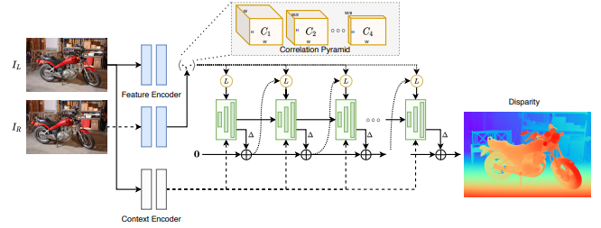
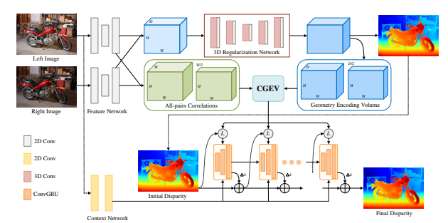

# Stereo Depth Estimation
This module is used to implement - train - inference different neural networks for Stereo depth estimation. The models are implemented in `pytorch` and the training pipeline is implemented on top of `pytorch lightning`. The training can be logged via **wandb** or **tensorboard**.

<p align="center">
  
</p>

## 1. Structure
```
.
├── callbacks ---> training callbacks
├── criterion.py ---> Loss function
├── data_modules ---> Data processing
├── __init__.py
├── models ---> Implementation of models
    ├── configs ---> configs of different models
├── README.md
├── scripts ---> Training scripts
├── train.py ---> Lightning pipeline
└── utils.py ---> Supported functions

```

## 2. How to launch the training
- There are different script in `scripts` corresponding different training on different datasets.
- At the moment, only the training on TartanAir dataset is supported.
- Training arguments:
```
options:
  -h, --help            show this help message and exit

pl_helper:
  --resume              Resume all the training, not only the weights.
  --save                Save every epoch and keep the top_k
  --save_top_k SAVE_TOP_K
                        Stores up to top_k models, by default 3. Use save_top_k=-1 to store all checkpoints
  --log [LOG]           Log results, can specify logger, by default None. If set but value not provided:wandb
  --log_save_dir [LOG_SAVE_DIR]
                        Path to save training log, by default None. If not set, use the default value in alonet_config.json
  --cp_save_dir [CP_SAVE_DIR]
                        Path to save training checkpoint, by default None. If not set, use the default value in alonet_config.json
  --cpu                 Use the CPU instead of scaling on the vaiable GPUs
  --run_id RUN_ID       Load the weights from this saved experiment
  --monitor MONITOR     Metric to save/load weights, by default 'val_loss'
  --no_run_id           Skip loading form run_id when an experiment is restored.
  --project_run_id PROJECT_RUN_ID
                        Project related with the run ID to load
  --expe_name EXPE_NAME
                        expe_name to be logged in wandb
  --no_suffix           do not add date suffix to expe_name
  --nostrict            load from checkpoint to run a model with different weights names (default False)

Data2DisparityModel:
  --batch_size BATCH_SIZE
                        Batch size
  --train_on_val
  --num_workers NUM_WORKERS
                        num_workers to use on the dataset
  --sequential_sampler  sample data sequentially (no shuffle)
  --sequence_size SEQUENCE_SIZE
                        Size of the desired sequence
  --HW HW HW            Size H W of resized frame

Tartain2DisparityModel:
  --train_envs TRAIN_ENVS [TRAIN_ENVS ...]
  --val_envs VAL_ENVS [VAL_ENVS ...]

LitDisparityModule:
  --model_config MODEL_CONFIG
                        Path to model json config file
  --lr LR               Learning rate
  --model_name {crestereo-base,igev-mbnet}
                        model to use
  --iters ITERS         Number of refinement iterations
```
- Details of models and how to run the training with those models are below.

## 3. How to launch the inference
- Script `nndepth/disparity/scripts/inference.py`:
```
options:
  -h, --help            show this help message and exit
  --weight WEIGHT     Path to model weight
  --left_path LEFT_PATH
                        Path to directory of left images
  --right_path RIGHT_PATH
                        Path to directory of right images
  --output OUTPUT       Path to save output. Directory in case of save_format == image, mp4 file in case of video
  --render              Render results
  --save_format {image,video}
                        Which format to save output. image or video are supported. Default: video

LitDisparityModule:
  --model_config MODEL_CONFIG
                        Path to model json config file
  --lr LR               Learning rate
  --model_name {crestereo-base,igev-mbnet,raft-base,raft-rep_vit,raft-rep_vit-group}
                        model to use
  --iters ITERS         Number of refinement iterations
```
- `--weight`: Path to model weights.
- The directory of images you want to infer must have below structure. Each images must have format `{ID}_{side}.png`.
- You can render the results directly use `--render`.
- There are 2 formats to save results:
  - image: Each frame & result will be saved as a png file.
  - video: All frames & results will be saved as a video.
- `--model_config`, `--model_name` and `--iters` are the argument that you use in your training. For inference, `--lr` is not necessasry.
```
.
├── image_left
│   ├── 0_left.png
│   ├── 1_left.png
│   ├── 2_left.png
│   ├── 3_left.png
│   └── 4_left.png
├── image_right
│   ├── 0_right.png
│   ├── 1_right.png
│   ├── 2_right.png
│   ├── 3_right.png
│   └── 4_right.png
```
- Detail commands & weights for each model are in the next section.

## 4. Supported models
- Trained weights and configuration can be found [here](https://drive.google.com/drive/folders/1hoOflbJ_75kmucyyN7eTwFT6le44oDuJ)
<details>
  <summary><b> RAFT-Stereo</b></summary>

  ## Architecture
  - Detail at [RAFT-Stereo](https://arxiv.org/pdf/2109.07547.pdf)
  <p align="center">
  
  </p>

- `ResNet50` & `RepViT` are used as backbone.

  ## Training command
  ```bash
  python nndepth/disparity/scripts/train_disparity_on_tartanair.py --model_name raft-rep_vit --model_config nndepth/disparity/models/configs/RepViTRAFTStereo.json --iters 6 --batch_size 4 --accumulate_grad_batches 2 --lr 1e-4 --limit_val_batches 200 --val_check_interval 5000 --max_step 150000 --HW 480 640 --train_envs abandonedfactory amusement carwelding endofworld gascola hospital japanesealley neighborhood ocean office office2 oldtown seasidetown seasonsforest seasonsforest_winter soulcity westerndesert --val_envs abandonedfactory_night --expe_name baseline --log --save --num_workers 8
  ```

</details>

<details>
  <summary><b> CreStereo</b></summary>

  ## Architecture
  - Detail at [CreStereo](https://arxiv.org/abs/2203.11483)
  <p align="center">
  
  </p>

- `ResNet50` is used as backbone.

  ## Training command
  ```bash
  python nndepth/disparity/scripts/train_disparity_on_tartanair.py --model_name igev-mbnet --model_config nndepth/disparity/models/configs/CREStereo.json --iters 4 --batch_size 4 --accumulate_grad_batches 2 --lr 5e-5 --limit_val_batches 200 --max_step 150000 --HW 384 480 --train_envs abandonedfactory amusement carwelding endofworld gascola hospital japanesealley neighborhood ocean office office2 oldtown seasidetown seasonsforest seasonsforest_winter soulcity westerndesert --val_envs abandonedfactory_night --expe_name baseline --log --save
  ```
</details>

<details>
  <summary><b> IGEV Stereo</b></summary>

  ## Architecture
  - Detail at [IGEV-Stereo](https://arxiv.org/pdf/2303.06615.pdf)
  <p align="center">
  
  </p>

- `MobilenetLarge-V3` is used as backbone.

  ## Training command
  ```bash
  python nndepth/disparity/scripts/train_disparity_on_tartanair.py --model_name igev-mbnet --model_config nndepth/disparity/models/configs/IGEVStereoMBNet.json --iters 6 --batch_size 4 --accumulate_grad_batches 2 --lr 5e-5 --limit_val_batches 200 --max_step 150000 --HW 384 480 --train_envs abandonedfactory amusement carwelding endofworld gascola hospital japanesealley neighborhood ocean office office2 oldtown seasidetown seasonsforest seasonsforest_winter soulcity westerndesert --val_envs abandonedfactory_night --expe_name baseline --log --save
  ```
</details>
