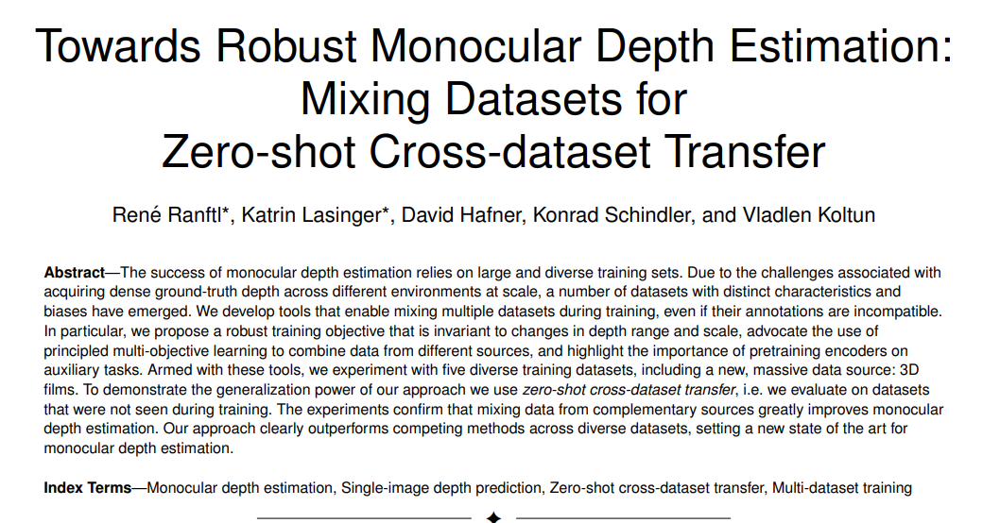

# MiDas

## Architecture
- Detail at [MiDas](https://arxiv.org/pdf/1907.01341)
<p align="center">

</p>

- `MobileNetV3` is used as backbone. More lightweight backbone will be added in the future.

## Weights
| Backbone              | Kitti d1 | Kitti EPE | Download |
| :---------------- | :------: | :----: | :---------: |
| **MBNetV3** | WIP | WIP | WIP |


## Training Configuration
```yaml
model:
  weights: null
  strict_load: true
  feature_channels: 64
trainer:
  workdir: /home/cv/nndepth/experiments
  project_name: midas
  experiment_name: mbnet_v3
  num_epochs: 100
  max_steps: null
  gradient_accumulation_steps: 4
  val_interval: 1.0
  log_interval: 10
  num_val_samples: null
  save_best_k_cp: 3
  tracker: wandb
  checkpoint: null
  resume: false
  lr: 0.0001
  lr_decay_every_epochs: 10
  viz_log_interval: 100
  trimmed_loss_coef: 1.0
  gradient_reg_coef: 0.1
  dtype: bfloat16
data:
  batch_size: 6
  num_workers: 18
  dataset_names:
  - hrwsi
  - tartanair
  - diml
  - hypersim
  HW:
  - 384
  - 384
  hrwsi_kwargs:
    hrwsi_dataset_dir: /data/hrwsi
  tartanair_kwargs:
    tartanair_dataset_dir: /data/tartanair
    tartanair_train_envs:
    - abandonedfactory
    - amusement
    - carwelding
    - endofworld
    - gascola
    - hospital
    - japanesealley
    - neighborhood
    - ocean
    - office
    - office2
    - oldtown
    - seasidetown
    - seasonsforest
    - seasonsforest_winter
    - soulcity
    - westerndesert
    tartanair_val_envs:
    - abandonedfactory_night
  diml_kwargs:
    diml_dataset_dir: /data/diml
    diml_scenes: null
    diml_outdoor_conf_threshold: 0.6
  hypersim_kwargs:
    hypersim_dataset_dir: /data/hypersim
    hypersim_val_sequences:
    - ai_055_001
    - ai_055_002
    - ai_055_003
    - ai_055_004
    - ai_055_005
    - ai_055_006
    - ai_055_007
    - ai_055_008
    - ai_055_009
    - ai_055_010
  no_augmentation: false
```


## How to Launch Training
```bash
python nndepth/models/midas/scripts/train.py mbnet_v3 --config_file nndepth/models/midas/yaml/train_mbnet_v3.yaml
```

## How to Launch Inference

```bash
# For image output
python nndepth/models/midas/scripts/inference.py mbnet_v3 \
    --weights /path/to/model/weights.pth \
    --input_path /path/to/input/image.png \
    --output /path/to/output/ \
    --HW 384 384 \
    --viz_hw 480 640 \
    --cmap magma

```

## How to Launch Evaluation

### Dataset-specific Instructions

#### TartanAir Dataset
```bash
python nndepth/models/midas/scripts/evaluate.py mbnet_v3 \
    --weights /path/to/model/weights.pth \
    --data_name tartanair \
    --data_config nndepth/models/midas/yaml/eval_tartanair.yaml \
    --output tartanair_results.txt \
    --max_depth 80.0
```

#### DIML Indoor Dataset
```bash
python nndepth/models/midas/scripts/evaluate.py mbnet_v3 \
    --weights /path/to/model/weights.pth \
    --data_name diml \
    --data_config nndepth/models/midas/yaml/eval_diml.yaml \
    --output diml_results.txt \
    --max_depth 100.0
```

#### Hypersim Dataset
```bash
python nndepth/models/midas/scripts/evaluate.py mbnet_v3 \
    --weights /path/to/model/weights.pth \
    --data_name hypersim \
    --data_config nndepth/models/midas/yaml/eval_hypersim.yaml \
    --output hypersim_results.txt \
    --max_depth 100.0
```

#### HRWSI Dataset
```bash
python nndepth/models/midas/scripts/evaluate.py mbnet_v3 \
    --weights /path/to/model/weights.pth \
    --data_name hrwsi \
    --data_config nndepth/models/midas/yaml/eval_hrwsi.yaml \
    --output hrwsi_results.txt \
    --max_depth 100.0
```
