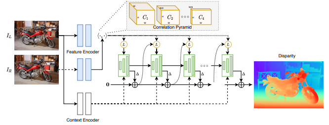

# RAFT-Stereo

## Architecture
- Detail at [RAFT-Stereo](https://arxiv.org/pdf/2109.07547.pdf)
<p align="center">

</p>

- `ResNet50` & `RepViT` are used as backbone.

## Model Configuration
**BaseRAFTStereo.yaml**
```yaml
# BaseRAFTStereo configuration file
name: BaseRAFTStereo
# BaseRAFTStereo
# RAFTStereo
# Initialize the RAFTStereo model.
#
#         Args:
#             hidden_dim (int): The hidden dimension. Default is 128.
#             context_dim (int): The context dimension. Default is 128.
#             corr_levels (int): The number of correlation levels. Default is 4.
#             corr_radius (int): The correlation radius. Default is 4.
#             tracing (bool): Whether to enable tracing for ONNX exportation. Default is False.
#             include_preprocessing (bool): Whether to include preprocessing steps. Default is False.
#             **kwargs: Additional keyword arguments.
#
iters: 12
fnet_dim: 256
hidden_dim: 128
context_dim: 64
corr_levels: 4
corr_radius: 4
tracing: false
include_preprocessing: false
weights: null
strict_load: true
```

## Data Configuration
**BaseRAFTStereo_Tartanair.yaml**
```yaml
# TartanairDisparityDataLoader configuration file

name: TartanairDisparityDataLoader
# TartanairDisparityDataLoader
#
#         DataLoader for training disparity on Tartanair dataset
#
#         Args:
#             dataset_dir (str): path to Tartanair dataset
#             batch_size (int): batch size
#             num_workers (int): number of workers
#             HW (Tuple[int, int]): image size
#             train_envs (List[str]): list of training environments
#             val_envs (List[str]): list of validation environments
#
dataset_dir: /data/tartanair
HW: [480, 640]
train_envs:
- abandonedfactory
- amusement
- carwelding
- endofworld
- gascola
- hospital
- japanesealley
- neighborhood
- ocean
- office
- office2
- oldtown
- seasidetown
- seasonsforest
- seasonsforest_winter
- soulcity
- westerndesert
val_envs:
- abandonedfactory_night

# BaseDataLoader
#
#         Base class for all data loaders
#
batch_size: 6
num_workers: 8
```

## Training Configuration
**RAFTTrainer.yaml**
```yaml
# RAFTTrainer configuration file

name: RAFTTrainer
# RAFTTrainer
#
#         Trainer for RAFT Stereo Model
#
#         Args:
#             lr (float): learning rate
#             max_steps (int): number of steps to train
#             num_epochs (int): number of epochs to train
#             weight_decay (float): weight decay
#             epsilon (float): epsilon for Adam optimizer
#             gradient_accumulation_steps (int): number of steps to accumulate gradients
#             val_interval (Union[float, int]): interval to validate
#             log_interval (int): interval to log
#
lr: 0.0001
num_epochs: 100
max_steps: 100000
weight_decay: 0.0001
epsilon: 1.0e-08
gradient_accumulation_steps: 2

# BaseTrainer
#
#         Base class for all trainers
#
#         Args:
#             workdir (str): path to save the experiment
#             project_name (str): name of the project
#             experiment_name (str): name of the experiment
#             val_interval (Union[float, int]): interval to validate
#             log_interval (int): interval to log
#             num_val_samples (int): number of samples during evaluation.
#                Useful to limit the number of samples during evaluation. Defaults to -1 (all samples)
#             save_best_k_cp (int): number of best checkpoints to save
#
workdir: /weights
project_name: raft_stereo
experiment_name: BaseRaftStereo
val_interval: 0.25
log_interval: 50
num_val_samples: -1
save_best_k_cp: 3
```

## How to Launch Training
```bash
python nndepth/nndepth/disparity/train.py --model_config nndepth/disparity/configs/models/BaseRAFTStereo.yaml --data_config nndepth/disparity/configs/data/BaseRAFTStereo_Tartanair.yaml --training_config nndepth/disparity/configs/training/RAFTTrainer.yaml
```

## How to Launch Inference
- Download checkpoint trained on TartanAir [here](https://drive.google.com/drive/folders/1OZIqRjqlF2fD4wwbMsFf5Lxx7ovYdu1D) (***will be updated soon***)

```bash
python nndepth/disparity/inference.py --model_config nndepth/disparity/configs/models/BaseRAFTStereo.yaml --weights PATH_TO_CHECKPOINT --left_path samples/stereo/left/ --right_path samples/stereo/right/ --HW 480 640 --output test --save_format image
```

## How to Launch Evaluation
- Download the config and checkpoint from [here](https://drive.google.com/drive/folders/1OZIqRjqlF2fD4wwbMsFf5Lxx7ovYdu1D).
- Change the path to your kitti [stereo 2015 dataset](https://www.cvlibs.net/datasets/kitti/eval_scene_flow.php?benchmark=stereo) in the [configuration](../configs/data/Kitti2015DisparityDataLoader.yaml) (`dataset_dir`). If you do not have Kitti on your PC, you can use the path to the [kitti-stereo-2015](../../../samples/kitti-stereo-2015/) in our samples.
- Launch the command:
```bash
python nndepth/disparity/evaluate.py --model_config BaseRAFTStereo.yaml --weights pytorch_model.bin --data_config Kitti2015DisparityDataLoader.yaml --metric_name kitti-d1 --metric_threshold 3 --output results.txt
```

## Performance
| Dataset | Metric | Value |
| :------ | :----: | :---: |
| **Kitti** | d1 | 0.08448 |
| **Kitti** | EPE | 1.47151 |
